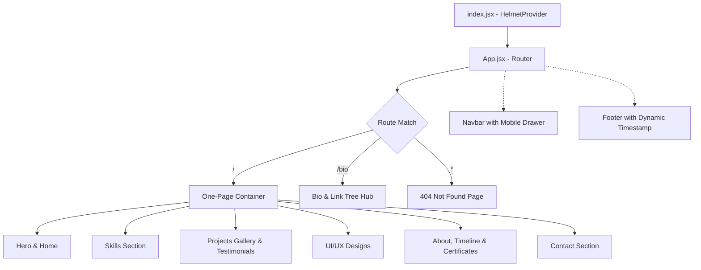

# Satyakiran's Portfolio

[](https://satyakiran.vercel.app/)
[](https://react.dev)
[](https://vitejs.dev/)
[](https://satyakiran.vercel.app/)
[](https://github.com/satyakiran29/satyakiran29.github.io)
[](https://opensource.org/licenses/MIT)

> **Official portfolio website of Satyakiran** — Full-Stack Web Developer, Android Developer, and Open Source Creator.

The live application is hosted at **[satyakiran.vercel.app](https://satyakiran.vercel.app/)**. *(Updated: September 2026)*

---

## 📑 Table of Contents
- [Overview](#overview)
- [Key Features](#key-features)
- [Tech Stack](#tech-stack)
- [Project Structure](#project-structure)
- [Getting Started](#getting-started)
- [Architecture & Flow](#architecture--flow)
- [SEO & Performance](#seo--performance)
- [Maintainer & Contributions](#maintainer--contributions)
- [License](#license)

---

## 🌟 Overview

This repository houses the modern, high-performance, single-page portfolio application (SPA) showcasing my software engineering projects, Android applications, UI/UX designs, certifications, and academic trajectory.

Built with **React 19**, **Vite 7**, and modern **Vanilla CSS + Glassmorphism**, it delivers ultra-fast loading, smooth micro-animations, and full mobile responsiveness across all device form factors.

---

## ✨ Key Features

- **📱 Fully Responsive & Mobile-First**: Adaptive fluid typography (`clamp`), sleek mobile drawer navigation, flexible card grids, and touch-optimized components.
- **🎨 Glassmorphism & Modern Aesthetics**: Curated color palette (dark theme, neon violet/emerald accents, backdrop blur filters, glowing avatars).
- **⚡ Interactive Hero & Skills Section**: Typewriter animation showcasing core disciplines, live work status indicator, and animated skill proficiency bars.
- **🔍 Filterable & Searchable Projects Gallery**: Instant multi-category filtering (Full Stack, Web, Android, AI/ML) and real-time search query matching.
- **📱 UI/UX Showcase**: Dedicated design showcase for custom widgets and application interfaces (featuring [Aniset](https://aniset.vercel.app/)).
- **📜 Education, Experience & Certificate Viewer**: Interactive career timeline and integrated in-browser PDF certificate previewer.
- **🎮 Bio & Link Tree (`/bio`)**: Comprehensive developer hub featuring real-time Steam gaming status integration and quick social links.
- **🚀 Advanced SEO**: Complete Schema.org JSON-LD structured data, dynamic meta tags with `react-helmet-async`, Open Graph previews, Twitter Cards, robots.txt, and sitemap.xml.

---

## 🛠️ Tech Stack

| Domain | Technologies & Libraries |
| :--- | :--- |
| **Frontend Framework** | React 19, React DOM, React Router v7 |
| **Build & Tooling** | Vite 7, ESLint |
| **Styling & Theme** | Modern Vanilla CSS, Styled Components (Footer), Glassmorphism |
| **SEO & Metadata** | React Helmet Async, Schema.org JSON-LD, Sitemap XML |
| **Media & Previews** | React PDF (pdfjs-dist), LightGallery, React Icons |
| **Analytics & Hosting** | Vercel Analytics, Vercel Edge Hosting |

---

## 📁 Project Structure

```
satyakiran29.github.io/
├── public/                # Static assets, resume, favicons, robots.txt, sitemap.xml
│   ├── images/            # Certificate and site preview images
│   ├── robots.txt         # Crawler indexing rules & sitemap pointer
│   ├── sitemap.xml        # SEO sitemap with page priorities
│   └── resume.pdf         # Downloadable CV / Resume
├── src/
│   ├── components/
│   │   ├── icons/         # Custom SVG icon components
│   │   ├── layout/        # Layout wrappers
│   │   ├── loader/        # Custom neon hex initial load animation
│   │   ├── pages/         # Page sections:
│   │   │   ├── home/      # Hero & Skills components
│   │   │   ├── about/     # Experience, Timeline & Certificate viewer
│   │   │   ├── project/   # Filterable projects gallery & client testimonials
│   │   │   ├── designs/   # UI/UX design widget showcase
│   │   │   ├── contact/   # Contact section & CTA
│   │   │   ├── bio/       # Developer Link Tree with Steam API
│   │   │   └── notfound/  # 404 error page
│   │   └── src/           # Global components (Navbar, Footer with live commit tracker)
│   ├── data/              # Static project details, certificates & designs
│   ├── App.jsx            # Routing configuration & loader state
│   ├── index.css          # Core CSS variables, typography & reset
│   └── index.jsx          # Entry point with HelmetProvider
├── index.html             # Main HTML entry with Schema.org JSON-LD & meta tags
├── vite.config.js         # Vite configuration
└── package.json           # Dependencies & scripts
```

---

## 🚀 Getting Started

### Prerequisites
- [Node.js](https://nodejs.org/) (v18 or higher recommended)
- [npm](https://www.npmjs.com/) or any compatible package manager (pnpm, yarn)

### Installation

1. **Clone the repository:**
   ```bash
   git clone https://github.com/satyakiran29/satyakiran29.github.io.git
   cd satyakiran29.github.io
   ```

2. **Install dependencies:**
   ```bash
   npm install
   ```

3. **Start local development server:**
   ```bash
   npm run dev
   ```
   Open `http://localhost:5173` in your browser.

4. **Build for production:**
   ```bash
   npm run build
   ```
   The compiled static output will be placed in the `dist/` directory.

5. **Preview production build:**
   ```bash
   npm run preview
   ```

---

## 📐 Architecture & Flow

### Navigation & Routing Hierarchy



---

## 🔍 SEO & Performance

- **Structured Data (JSON-LD)**: Includes `Person` and `WebSite` schemas providing search engines with verified developer credentials, social handles, and site taxonomy.
- **Social Graph Sharing**: Fully configured Open Graph and Twitter Card tags with high-resolution preview cards.
- **Sitemap & Robots**: Standardized `sitemap.xml` with updated priority levels and `robots.txt` directives.
- **Fast Performance**: Code-split bundle with responsive image formats (`.webp`), asynchronous font preconnecting, and cached assets.

---

## 👤 Maintainer

**Satyakiran**
- GitHub: [@satyakiran29](https://github.com/satyakiran29)
- LinkedIn: [satyakiran29](https://in.linkedin.com/in/satyakiran29)
- Play Store: [SkDev Console](https://play.google.com/store/apps/dev?id=9166037782169864125)
- Telegram: [@skdev1](https://t.me/skdev1)
- Portfolio: [satyakiran.vercel.app](https://satyakiran.vercel.app/)

---

## 📄 License

This project is licensed under the **MIT License**. See the [LICENSE](LICENSE) file for details.
